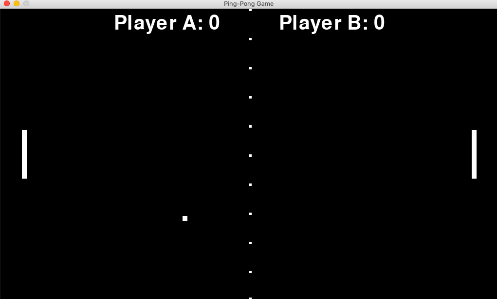

# PING PONG GAME WITH PYGAME MODULE

An attempt to recreate the Complete Ping-Pong Game with Pygame module.

### Game Start Window

## Controls

### Arrow keys for Direction:

#### For Player A:
	
	To move paddle up press 'u'.
	To move paddle down press 'd'.

#### For Player B:
 	
 	To move paddle up press 'UP_ARROW'.
 	To move paddle down press 'DOWN_ARROW'.

### Game Over Window

## Dependencies

Pygame 1.9.2 (Python 3) or later

### DISCLAIMER:

This project is licensed under GNU General Public License v3.0

